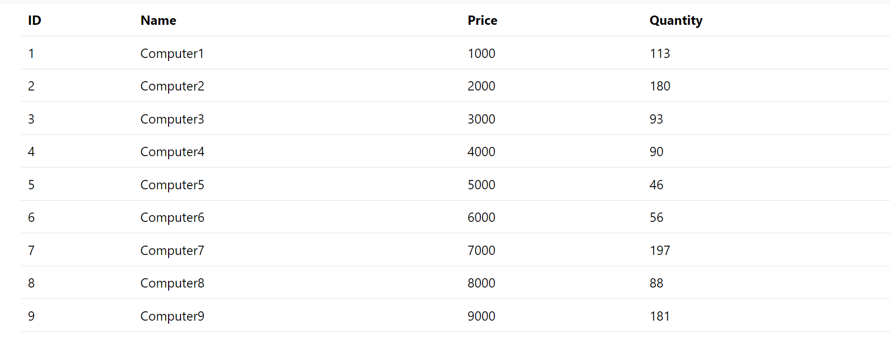
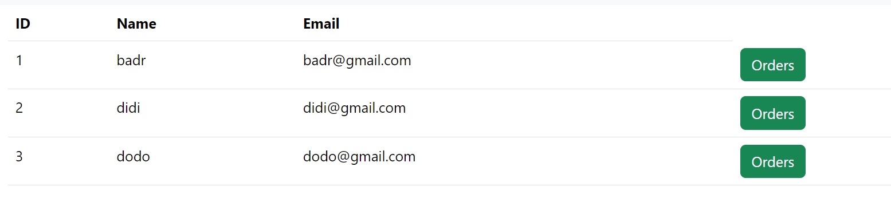
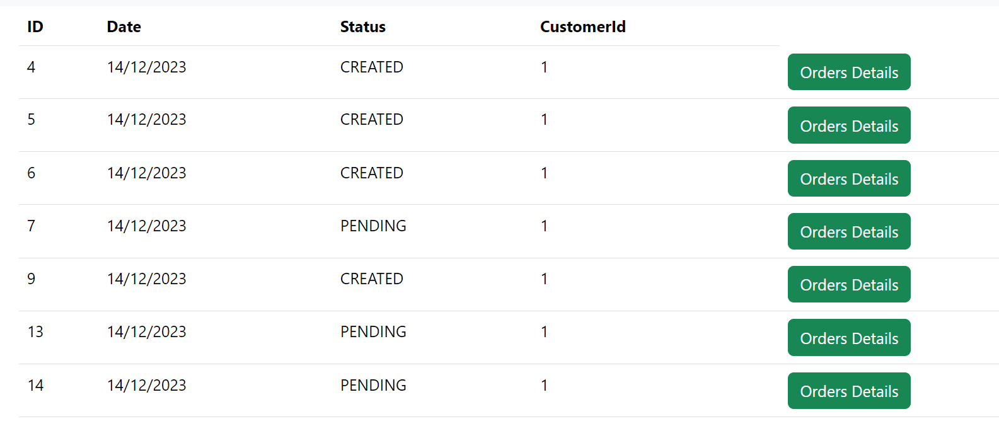
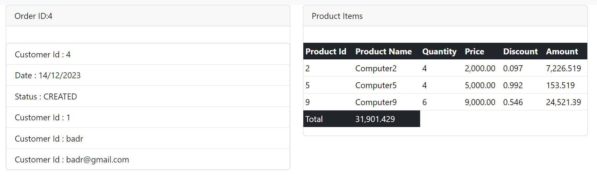

# Plateforme E-Commerce basée sur les Microservices

## Aperçu

Cette plateforme utilise des technologies de pointe pour garantir la scalabilitéet la flexibilité.

## Technologies Utilisées

1. **Spring Cloud Config :** Gestion centralisée de la configuration pour des ajustements aisés.

2. **Spring Cloud Gateway :** Passerelle API offrant un point d'entrée unifié pour les microservices.

3. **Service Client, Service d'Inventaire, Service de Commande :** Microservices dédiés à des domaines métier spécifiques.

4. **Consul Config :** Découverte dynamique des services pour une communication efficace.

5. **Vault :** Gestion sécurisée des données sensibles pour une sécurité renforcée.

6. **Spring Boot Actuator :** Fournit des fonctionnalités pour surveiller et gérer les applications Spring Boot.

7. **Frontend Web avec Angular :** Offre une expérience utilisateur fluide et optimale.

## Pour Commencer

1. Clonez le dépôt.
2. Configurez Spring Cloud Config pour une gestion centralisée de la configuration.
3. Utilisez Spring Cloud Gateway pour la gestion de l'API.
4. Déployez et exécutez les microservices (Service Client, Service d'Inventaire, Service de Commande,).
5. Assurez-vous de Consul Config pour une découverte dynamique des services.
6. Implémentez Vault pour une gestion sécurisée des données.
7. Lancez le Frontend Web basé sur Angular pour les interactions utilisateur.

Joyeux codage !
